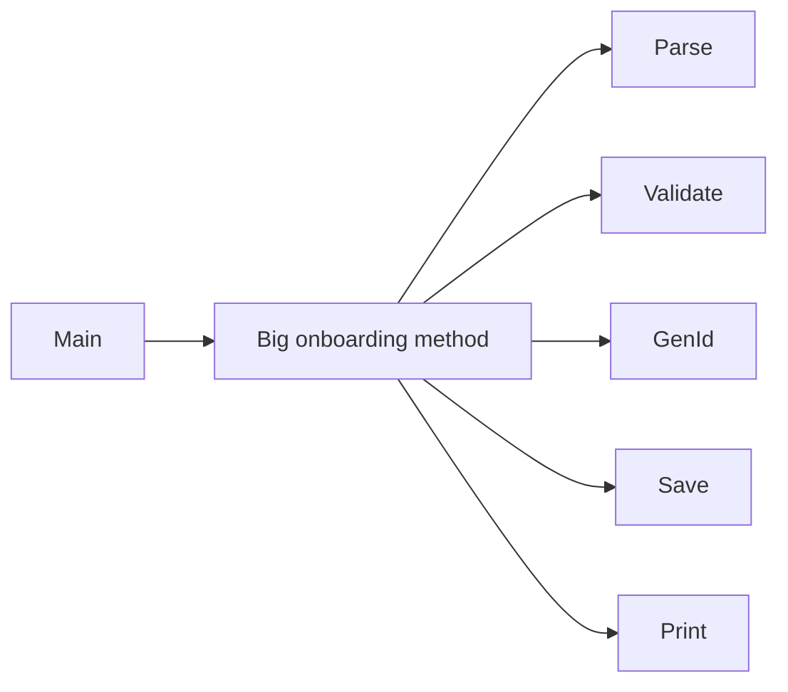
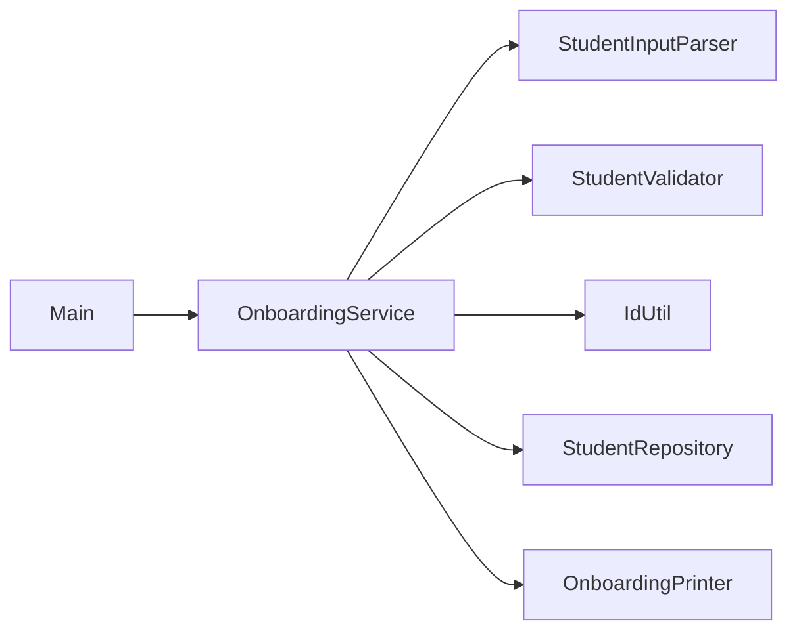

## Ex1 – Student Onboarding

### Problem (original code)
- One big place was doing many things at once: reading input, parsing, validating, generating IDs, saving, and printing.
- Because of this, changing one part (like validation) could easily break other parts, and testing pieces alone was hard.

### How this answer solves it
- The work is split into small classes:
  - `StudentInputParser` only parses the raw string.
  - `StudentValidator` only checks the data and returns errors.
  - `IdUtil` only creates the student ID.
  - `FakeDb`/`StudentRepository` only store data.
  - `OnboardingPrinter` only prints messages.
  - `OnboardingService` just coordinates all of them.
- Each class now has one simple job, so changes are safer and easier to understand.

### Design – before vs after

### Files overview (why each class exists)

- `Main` – runs the onboarding demo end-to-end.
- `StudentInputParser` – turns the raw input string (e.g. `name=...;email=...`) into a `ParsedStudent` object.
- `ParsedStudent` – holds the parsed values before validation.
- `StudentValidator` – checks the parsed values (name/email/phone/program) and returns error messages.
- `StudentRecord` – represents a stored student row (the “final” data that goes into the repository).
- `StudentRepository` – interface for saving and counting students; allows different storage implementations.
- `FakeDb` – in-memory implementation of `StudentRepository` used for this assignment/demo.
- `IdUtil` – creates the student ID from the current count, so ID logic is not mixed with business flow.
- `OnboardingPrinter` – prints input, errors, and success messages; keeps console output out of business logic.
- `TextTable` – renders the contents of `FakeDb` as a simple text table.
- `OnboardingService` – the main orchestration class that ties parser, validator, repository, ID generator, and printer together.

