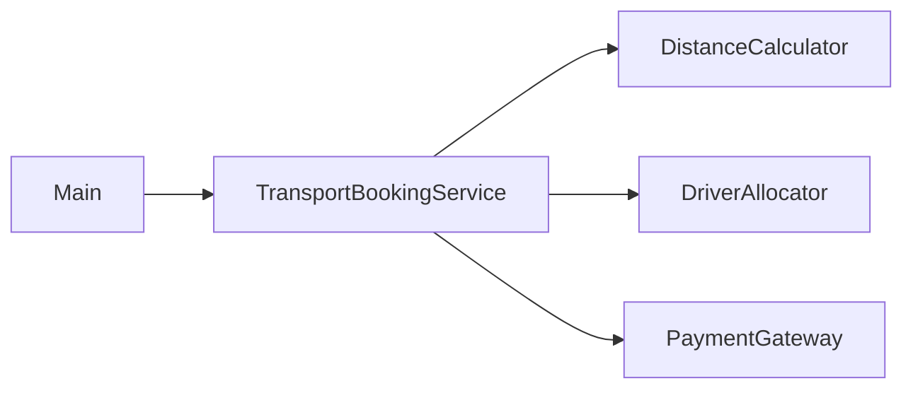
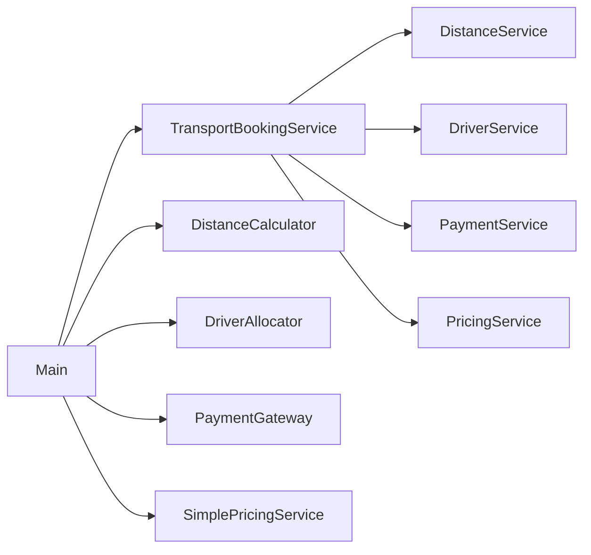

## Answer overview (structure before vs after)

**Problem in the original design**

- `TransportBookingService.book` directly created concrete collaborators:
  - `new DistanceCalculator()`
  - `new DriverAllocator()`
  - `new PaymentGateway()`
- Business logic (pricing) and infrastructure (distance, driver, payment) were mixed inside one method.
- Testing booking required using real implementations; adding a new payment method meant editing booking logic.

**How the answer fixes it**

- Introduce abstractions:
  - `DistanceService` – `double km(GeoPoint a, GeoPoint b)`.
  - `DriverService` – `String allocate(String studentId)`.
  - `PaymentService` – `String charge(String studentId, double amount)`.
  - `PricingService` – `double calculateFare(double km)`.
- Make `TransportBookingService` depend **only** on these interfaces, provided via constructor.
- Implement concrete classes (`DistanceCalculator`, `DriverAllocator`, `PaymentGateway`, `SimplePricingService`) that implement the interfaces.
- Move dependency construction to `Main`, which wires the service with specific implementations.

### Design – before vs after

Now:

- The booking service is independent of concrete implementations (pure DIP).
- You can easily inject mocks or alternative implementations (e.g., different payment provider) without changing booking logic.
