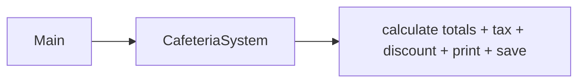
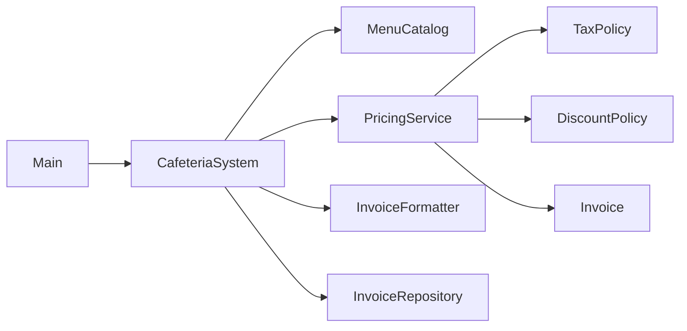

## Ex2 – Cafeteria Billing

### Problem (original code)
- The same method was doing menu lookups, subtotal, tax, discount, printing, and saving.
- Tax and discount rules were hard-coded inside this method, so changing a rule meant touching core billing code.

### How this answer solves it
- We introduced clear roles:
  - `TaxPolicy` and `DiscountPolicy` decide tax % and discount.
  - `PricingService` uses the menu, tax, and discount to build an `Invoice`.
  - `InvoiceFormatter` knows how to print the invoice nicely.
  - `CafeteriaSystem` just wires everything together and calls them.
- Now pricing rules can change or new policies can be added without rewriting the main flow.

### Design – before vs after

### Files overview (why each class exists)

- `Main` – runs the cafeteria billing demo.
- `MenuItem` – represents one item in the cafeteria menu (id, name, price).
- `MenuCatalog` – stores and looks up `MenuItem`s by id.
- `OrderLine` – describes one line in an order (which item and how many).
- `Invoice` – holds all computed values for a bill: lines, subtotal, tax %, tax amount, discount, and total.
- `Invoice.Line` – one computed line of the invoice (name, quantity, line total).
- `TaxPolicy` – interface describing how to compute the tax percentage for a given customer type.
- `DefaultTaxPolicy` – default implementation of tax rules for students, staff, and others.
- `DiscountPolicy` – interface describing how to compute discounts using customer type, subtotal, and line count.
- `DefaultDiscountPolicy` – default discount behavior (e.g. student vs staff).
- `PricingService` – takes an order and menu and uses `TaxPolicy`/`DiscountPolicy` to build an `Invoice`.
- `InvoiceFormatter` – converts an `Invoice` into a human-readable text bill.
- `InvoiceRepository` – abstraction for saving invoice content somewhere.
- `FileStore` – simple in-memory implementation of `InvoiceRepository` for this assignment.
- `CafeteriaSystem` – high-level application service that wires catalog, pricing, formatter, and repository together for checkout.

