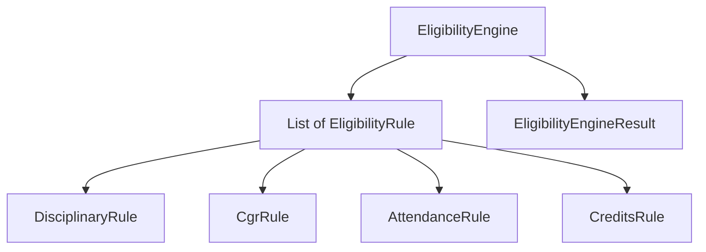

## Ex3 – Placement Eligibility (Rules Engine)

### Problem (original code)
- All eligibility checks were in one long `if / else if` chain inside `EligibilityEngine`.
- To add or change a rule, you had to edit this central method, which easily becomes messy and fragile.

### How this answer solves it
- We created an `EligibilityRule` interface and made each rule its own class:
  - `DisciplinaryRule`, `CgrRule`, `AttendanceRule`, `CreditsRule`.
- `EligibilityEngine` now just keeps a list of rules and runs them in order, stopping at the first failure to keep the same output.
- To add a new rule, you add a new class and plug it into the list, without changing the engine logic.

### Design – before vs after

```mermaid
flowchart TD
    EligibilityEngine --> Evaluate[evaluate()]
    Evaluate --> BigIf[one long if / else-if chain]
    BigIf --> Result
```



### Files overview (why each class exists)

- `Main` – runs the placement eligibility demo for one sample student.
- `StudentProfile` – input details used to decide eligibility (roll, name, CGR, attendance, credits, disciplinary flag).
- `LegacyFlags` – defines constants for disciplinary flags and a helper to print them as names.
- `EligibilityRule` – interface for one eligibility rule that either passes or returns a failure reason string.
- `DisciplinaryRule` – checks for non-`NONE` disciplinary flags.
- `CgrRule` – checks minimum CGR threshold.
- `AttendanceRule` – checks minimum attendance percentage.
- `CreditsRule` – checks minimum earned credits.
- `EligibilityEngineResult` – holds final status (`ELIGIBLE` / `NOT_ELIGIBLE`) and a list of reasons.
- `ReportPrinter` – prints the student information and the evaluation result in a readable format.
- `FakeEligibilityStore` – fake storage that records that an evaluation for a roll number was saved.
- `EligibilityEngine` – coordinates running all rules in order, building a result, printing it, and saving the status.


