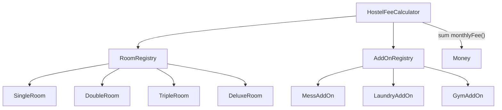

## Ex4 – Hostel Fee Calculator

### Problem (original code)
- Room prices were chosen with a `switch`, and add-on prices with `if / else if` branches inside one method.
- Every time you add a new room type or add-on, you must edit that method, which breaks the “closed for modification” idea.

### How this answer solves it
- We created a `PricingComponent` interface and gave each room/add-on its own class (e.g., `SingleRoom`, `MessAddOn`).
- `RoomRegistry` and `AddOnRegistry` map IDs to these components.
- `HostelFeeCalculator` simply looks up components and sums their `monthlyFee()`, while printing and saving stay the same.
- New room/add-on = new class + registry entry, no change to the core loop.

### Design – before vs after

```mermaid
flowchart TD
    HostelFeeCalculator --> Calc[calculateMonthly()]
    Calc --> RoomSwitch[switch on roomType]
    Calc --> AddOnIf[if / else-if for add-ons]
    AddOnIf --> Total
```



### Files overview (why each class exists)

- `Main` – runs the hostel fee calculator demo for one booking request.
- `BookingRequest` – describes a student’s choice of room type and add-ons.
- `AddOn` – enum of add-on types (MESS, LAUNDRY, GYM) used instead of raw strings.
- `LegacyRoomTypes` – integer codes and names for room types to match a legacy API.
- `Money` – value object that wraps a `double` with rounding and addition behavior.
- `PricingComponent` – common interface for anything that has a monthly fee (rooms and add-ons).
- `SingleRoom`, `DoubleRoom`, `TripleRoom`, `DeluxeRoom` – pricing components for each room type.
- `MessAddOn`, `LaundryAddOn`, `GymAddOn` – pricing components for each add-on type.
- `RoomRegistry` – maps room type codes to room pricing components.
- `AddOnRegistry` – maps `AddOn` values to add-on pricing components.
- `ReceiptPrinter` – prints room, add-ons, monthly amount, deposit, and total due.
- `FakeBookingRepo` – fake repository that records a saved booking id.
- `HostelFeeCalculator` – uses registries to sum monthly costs, adds deposit, prints, and saves the booking.


