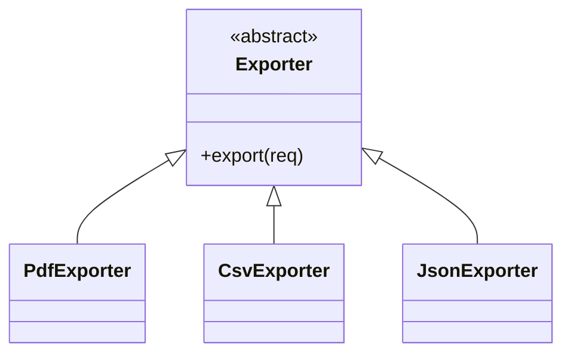
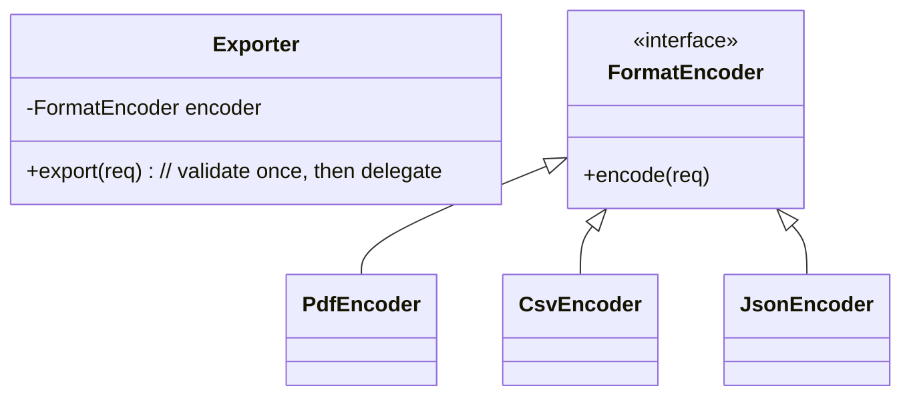

## Ex5 – File Exporters (LSP)

### Problem (original code)
- All exporters extended `Exporter` but behaved very differently:
  - PDF threw errors for long bodies.
  - CSV silently changed text (removed commas/newlines).
  - JSON returned empty bytes for `null` requests.
- The base type did not clearly say what was allowed, so swapping one exporter for another was unsafe.

### How this answer solves it
- `Exporter` is now a single class with a clear contract:
  - It checks that the request, title, and body are not `null` and throws the same kind of exception if they are.
- Actual formatting is moved into `FormatEncoder` implementations:
  - `PdfEncoder`, `CsvEncoder`, `JsonEncoder`.
- Callers always use `Exporter` in the same way and can plug in any encoder without surprises.

### Design – before vs after

### Files overview (why each class exists)

- `ExportRequest` – input for exports, holding a title and body.
- `ExportResult` – output of exports, with MIME `contentType` and raw `bytes`.
- `SampleData` – convenience class that returns a fixed sample body so all formats use the same data.
- `FormatEncoder` – strategy interface for converting an `ExportRequest` into an `ExportResult`.
- `PdfEncoder` – encoder that builds a fake PDF string and enforces the “max 20 chars” rule.
- `CsvEncoder` – encoder that outputs CSV with correct quoting; fixes the original lossy behavior.
- `JsonEncoder` – encoder that outputs a minimal JSON object with simple string escaping.
- `Exporter` – core class that defines and enforces the export contract and delegates to a chosen `FormatEncoder`.
- `Main` – demo that creates one request, three exporters (PDF/CSV/JSON), and prints either error messages or byte counts.

