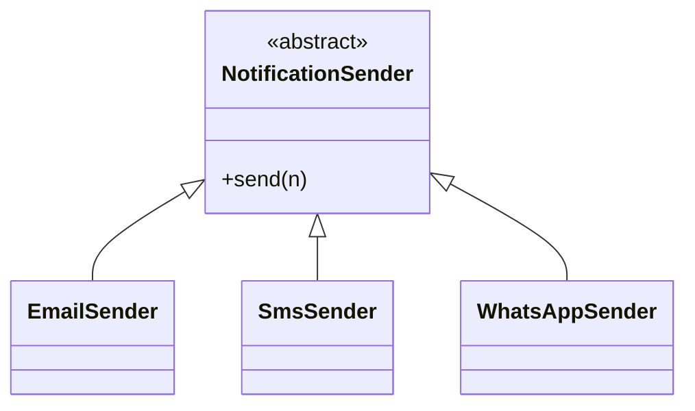
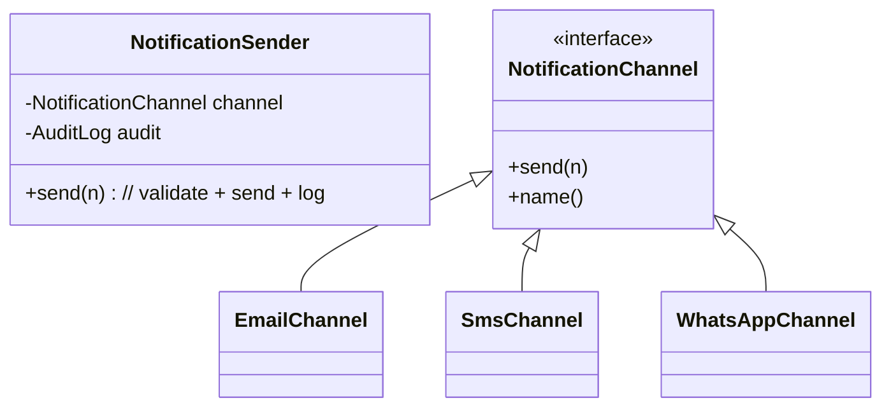

## Ex6 – Notification Sender (LSP)

### Problem (original code)
- Different `NotificationSender` subclasses changed behavior in unexpected ways:
  - Email silently cut the body text.
  - WhatsApp added extra phone checks not mentioned in the base class.
  - Each subclass handled logging in its own way.
- A variable of type `NotificationSender` did not guarantee similar, predictable behavior (LSP was broken).

### How this answer solves it
- We created a `NotificationChannel` interface and kept only one `NotificationSender` class.
- `NotificationSender`:
  - Checks that the notification is not `null`.
  - Calls `channel.send(n)`.
  - Logs `"<channel-name> sent"` in `AuditLog`.
- Each channel (`EmailChannel`, `SmsChannel`, `WhatsAppChannel`) has its own simple validation and printing, but follows the same contract.
- Now you can swap channels without breaking how `NotificationSender` is used.

### Design – before vs after

### Files overview (why each class exists)

- `Notification` – holds the message subject, body, email address, and phone number that all channels use.
- `AuditLog` – collects log entries and reports how many actions were logged.
- `NotificationChannel` – interface that defines how a channel sends a notification and how it names itself.
- `EmailChannel` – channel that sends notifications via email and checks for a non-null email address.
- `SmsChannel` – channel that sends notifications as SMS and checks for a non-null phone number.
- `WhatsAppChannel` – channel that sends notifications via WhatsApp and enforces phone numbers starting with `+`.
- `NotificationSender` – single base class that validates notifications, calls a `NotificationChannel`, and logs successful sends.
- `Main` – demo that sends the same `Notification` over email, SMS, and WhatsApp, then prints a summary of audit entries.

