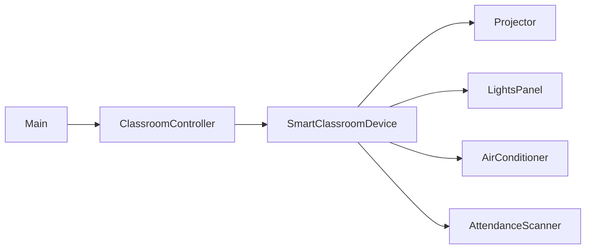
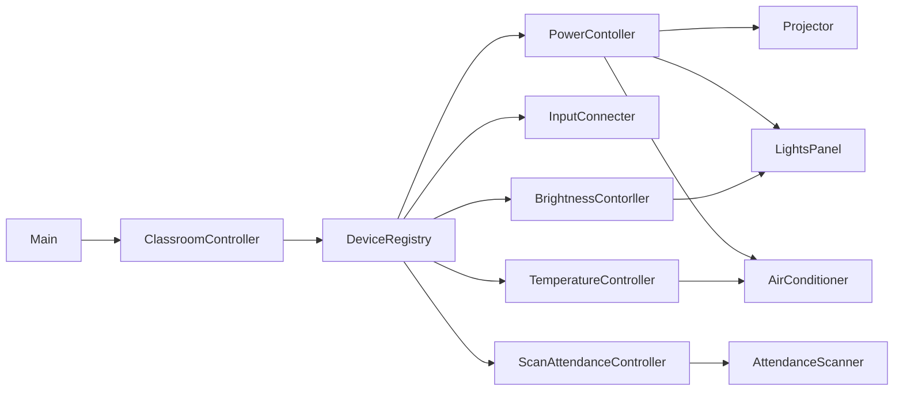

## Ex7 – Smart Classroom Devices (ISP)

### Problem (original code)

- One fat interface `SmartClassroomDevice` had **all** operations: power, brightness, temperature, attendance scan.
- Each concrete device (projector, lights, AC, scanner) had to implement methods it did not need, often with dummy logic.
- The controller depended on this fat interface, so its type signature suggested every device could do everything.
- Adding a new device (for example, a smart board) would again require implementing many irrelevant methods.

### How this answer solves it

- Keep `SmartClassroomDevice` only as a legacy type, but stop using it for new behavior.
- Introduce **capability interfaces**:
  - `PowerContoller` – things that can be powered on/off.
  - `InputConnecter` – things that can switch input (e.g., projector).
  - `BrightnessContorller` – things that can change brightness (e.g., lights).
  - `TemperatureController` – things that can set temperature (e.g., AC).
  - `ScanAttendanceController` – things that can scan attendance.
- `DeviceRegistry` returns devices **by capability**, not by a big interface:
  - `getFirstOfType(PowerContoller.class)`
  - `getAllByCapability(PowerContoller.class)`, etc.
- `ClassroomController` now asks only for the capabilities it actually uses, instead of one fat interface.

### Design – before vs after

Now:

- Each device implements only the capability interfaces it actually supports.
- `ClassroomController` depends on **small, focused interfaces** (ISP), not a giant “kitchen sink” type.

