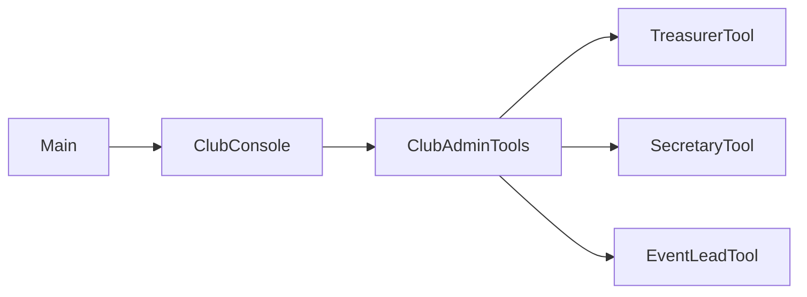
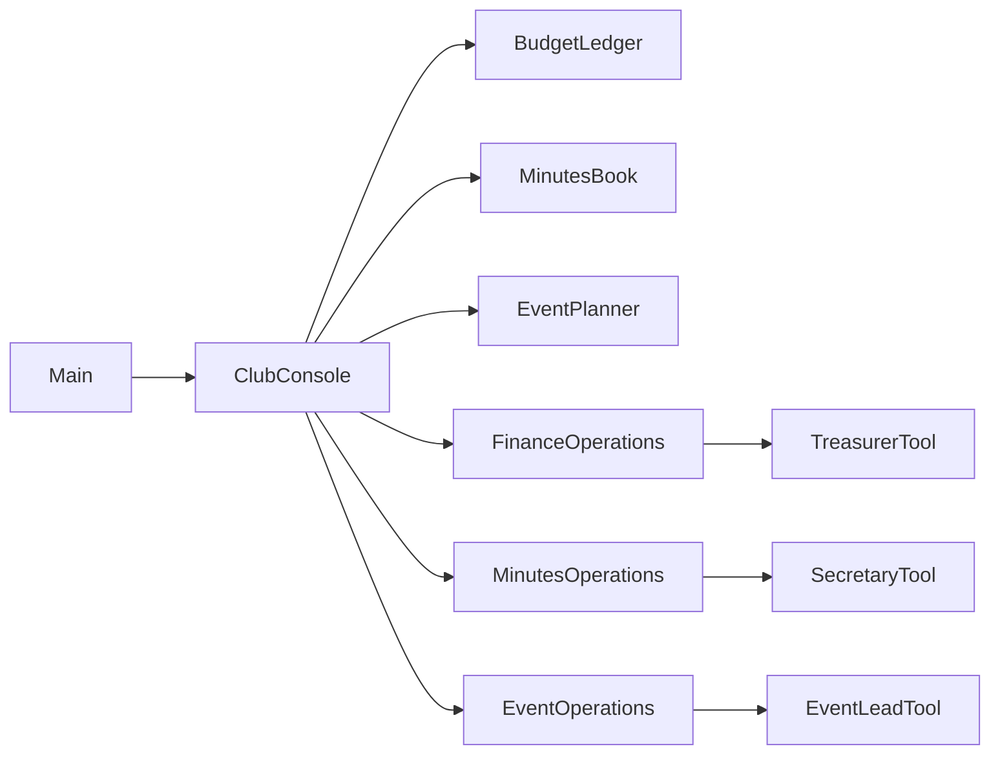

## Ex8 – Club Admin Tools (ISP)

### Problem (original code)

- One big interface `ClubAdminTools` mixed **finance**, **minutes**, and **event** operations.
- Role-specific tools (treasurer, secretary, event lead) implemented this fat interface, but many methods were irrelevant or dummy.
- `ClubConsole` depended on the big interface, even though for each role it only needed a subset of methods.
- Adding a new role (e.g., publicity lead) would again force implementing unrelated operations.

### How this answer solves it

- Split the fat interface into **capability-specific** interfaces:
  - `FinanceOperations` – things the treasurer needs (e.g., `addIncome`).
  - `MinutesOperations` – operations for recording and querying minutes.
  - `EventOperations` – operations for creating events and getting event counts.
- Implement role tools against only the relevant interface:
  - `TreasurerTool` implements `FinanceOperations`.
  - `SecretaryTool` implements `MinutesOperations`.
  - `EventLeadTool` implements `EventOperations`.
- `ClubConsole` composes the three capabilities:
  - Takes `BudgetLedger`, `MinutesBook`, `EventPlanner`.
  - Creates tools per role and calls only the operations that matter for that role.

### Design – before vs after

Now:

- Each role tool implements only what it actually needs.
- `ClubConsole` depends on **small capability interfaces** instead of a giant admin interface.

