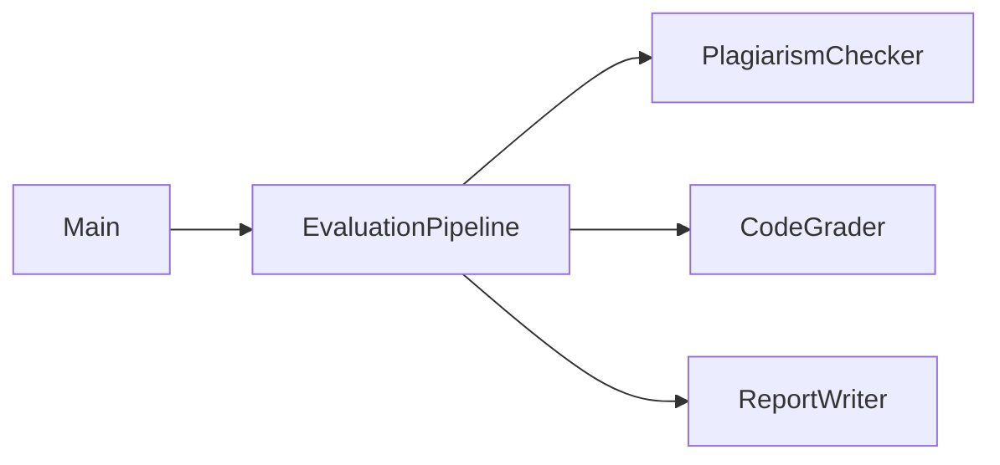
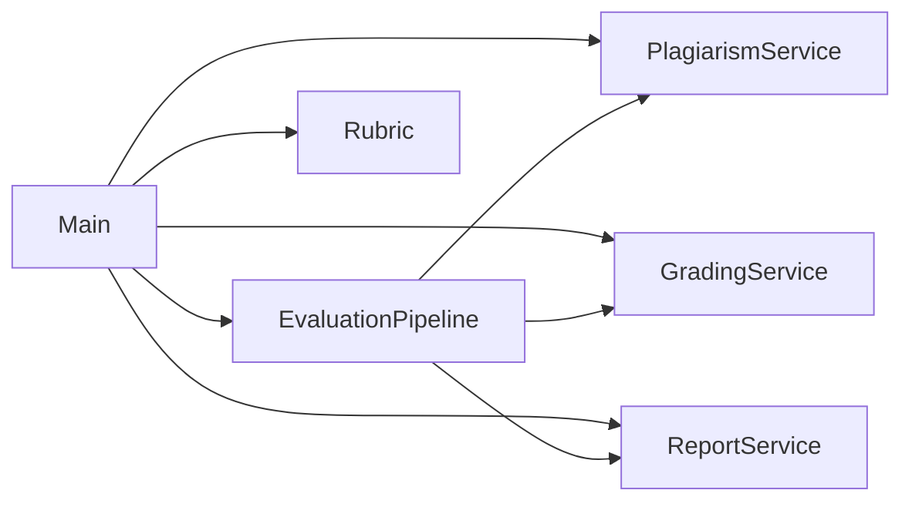

**Problem in the original design**

- `EvaluationPipeline.evaluate` directly instantiated concrete services (`PlagiarismChecker`, `CodeGrader`, `ReportWriter`) using `new`.
- The high-level pipeline depended on low-level implementation classes, which made it hard to:
  - test the pipeline in isolation,
  - swap or extend graders/checkers/writers,
  - keep configuration out of orchestration code.

**How the answer fixes it**

- Introduce narrow abstractions:
  - `PlagiarismService` – `int check(Submission submission)`.
  - `GradingService` – `int grade(Submission submission, Rubric rubric)`.
  - `ReportService` – `String write(Submission s, int plag, int code)`.
- Make `EvaluationPipeline` depend **only** on these interfaces plus `Rubric`, injected via constructor.
- Provide concrete implementations (`PlagiarismChecker`, `CodeGrader`, `ReportWriter`) that implement the interfaces, wired together in `Main`.
- Keep the output and evaluation logic identical, but move construction and configuration outside the pipeline.

### Design – before vs after

Now the pipeline:

- is easy to test using fake implementations of the three services,
- does not change when you introduce new grading or plagiarism strategies.
