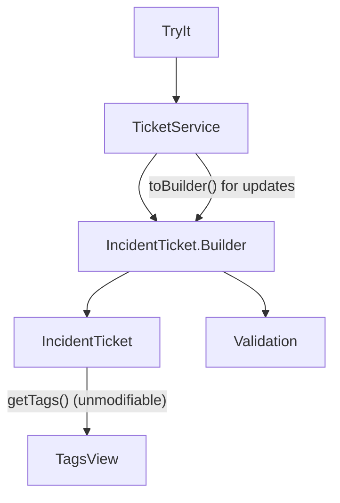

### Exercise B — Immutable Incident Tickets (Answer)

**Problem in the question code**

- `IncidentTicket` was **mutable**:
  - multiple constructors,
  - public setters for every field,
  - a mutable `List<String> tags` directly exposed via `getTags()`.
- `TicketService` created a ticket and then **mutated** it later (changing priority, tags, etc.).
- Validation was **scattered** (some in `TicketService`, some missing), so it was easy to miss checks.
- `TryIt` could mutate the same ticket object after it was “created”, breaking auditability and invariants.

**How the answer solves it**

- `IncidentTicket` is now an **immutable class**:
  - all fields are `private final`,
  - no setters,
  - `tags` is defensively copied and wrapped in an unmodifiable list.
- Introduce `IncidentTicket.Builder`:
  - required fields: `id`, `reporterEmail`, `title`,
  - optional fields: `description`, `priority`, `tags`, `assigneeEmail`, `customerVisible`, `slaMinutes`, `source`,
  - fluent API like `builder().id(...).title(...).build()`.
- **Centralize validation** in `Builder.build()` using `Validation` helpers:
  - `requireTicketId`, `requireEmail`, `requireNonBlank`, `requireMaxLen`, `requireOneOf`, `requireRange`.
- `TicketService`:
  - creates a ticket using the builder (no post-creation mutation),
  - “updates” (assign, escalate) by calling `toBuilder()` on an existing `IncidentTicket` and building a **new instance**.
- `TryIt` shows:
  - original ticket,
  - new instances for assigned/escalated versions,
  - attempts to modify tags from outside fail (unmodifiable list).

---

### Design – before vs after

```mermaid
flowchart TD
    TryIt --> TicketService
    TicketService --> IncidentTicket
    IncidentTicket --> TagsList[tags (mutable list)]
```



Now:

- Tickets are **immutable** snapshots: once created, their state (including tags) cannot change.
- All validation logic is in **one place** (`build()`), making it easier to reason about and extend.
- Services create **new objects** for updates, which is safer for logs, auditing, and concurrency.

