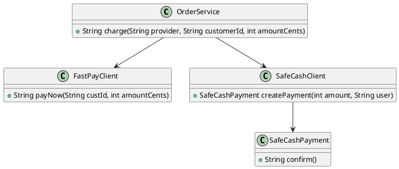
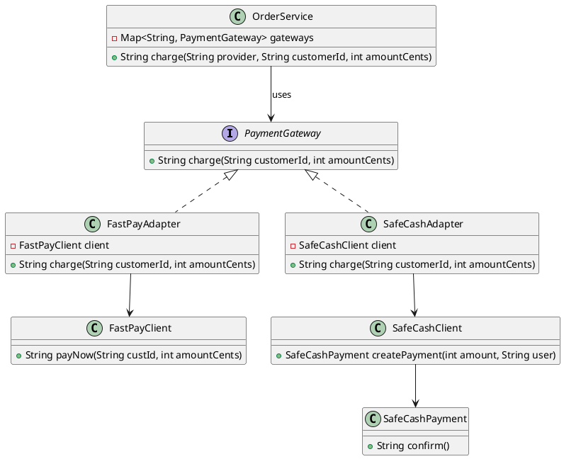

### Adapter — Payments (Answer)

**Problem in the question code**

- `OrderService` was originally intended to talk to concrete SDKs (`FastPayClient`, `SafeCashClient`), with provider-specific glue logic and string-based branching.
- This couples business logic to SDKs and makes adding a new provider require changes inside `OrderService`.

**How the answer fixes it**

- Define a stable target interface `PaymentGateway` with `charge(String customerId, int amountCents)`.
- Implement **adapters** `FastPayAdapter` and `SafeCashAdapter` that wrap the SDKs and translate to/from the common interface.
- `OrderService` now depends only on `PaymentGateway` and a `Map<String, PaymentGateway>` registry.
- `App` wires the map with the proper adapters; adding a new provider is just adding another entry.

---

### Before – conceptual structure

```text
App
  └─ calls OrderService.charge(provider, ...)
         ├─ if "fastpay"  → uses FastPayClient directly
         └─ if "safecash" → uses SafeCashClient / SafeCashPayment directly
```

Responsibilities are mixed:

- `OrderService` knows **which SDK** to use.
- `OrderService` knows **how** to call each SDK (different methods / objects).

---

### After – Adapter-based structure

```text
App
  └─ builds Map<String, PaymentGateway>
         "fastpay"  → FastPayAdapter(FastPayClient)
         "safecash" → SafeCashAdapter(SafeCashClient)

OrderService
  └─ charge(provider, ...)
         └─ gateways.get(provider).charge(customerId, amountCents)

FastPayAdapter        SafeCashAdapter
  └─ FastPayClient      └─ SafeCashClient → SafeCashPayment
```

Key properties:

- `OrderService` is **closed for modification** when adding new providers; it only sees `PaymentGateway`.
- Each adapter hides SDK-specific details (method names, extra objects, etc.).
- The design follows the **Adapter** pattern: `PaymentGateway` is the target, SDKs are adaptees, `*Adapter` classes are concrete adapters.

---

### UML – Before (class-level)



### UML – After (with Adapters)


