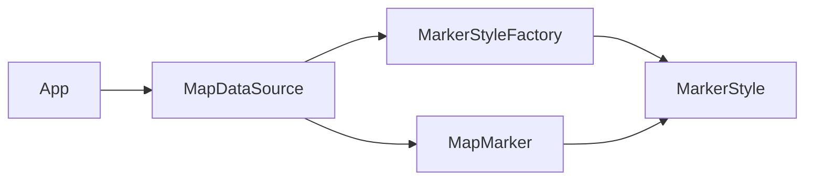

### Flyweight — Map Marker Styles (Answer)

**Problem in the question code**

- Each `MapMarker` creates its own `MarkerStyle` with `new MarkerStyle(...)`.
- Thousands of markers with the same shape/color/size/filled combination allocate thousands of duplicate style objects.
- `MarkerStyle` is mutable, so shared use would be unsafe even if attempted.

**How the answer fixes it**

- Extract `MarkerStyle` as an **immutable flyweight** (all fields `final`, no setters).
- Introduce `MarkerStyleFactory` that caches `MarkerStyle` instances by a stable key (`shape|color|size|filledFlag`).
- Change `MapMarker` to hold:
  - `MarkerStyle` (intrinsic, shared)
  - `lat`, `lng`, `label` (extrinsic, per marker)
- Update `MapDataSource` to call `MarkerStyleFactory.get(...)` and pass the shared style into the `MapMarker` constructor (no `new MarkerStyle(...)` inside marker creation).

---

### Before – conceptual structure

- Every `MapMarker` owns its own `MarkerStyle`.
- Many identical styles are duplicated in memory.

---

### After – Flyweight-based structure

- All style combinations are created and cached in `MarkerStyleFactory`.
- `MapMarker` only stores a reference to a shared `MarkerStyle` instance plus its own coordinates/label.
- `QuickCheck` now reports a small number of unique style instances (bounded by shape×color×size×filled), confirming Flyweight sharing.

