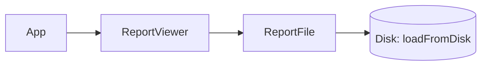
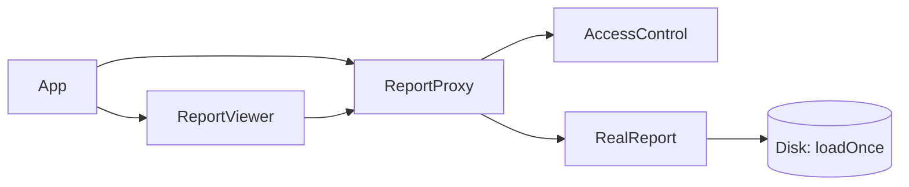

### Proxy — Secure & Lazy-Load Reports (Answer)

**Problem in the question code**

- `ReportViewer` depends directly on concrete `ReportFile`.
- Every `display()` call triggers an expensive disk load, even for repeated views of the same report.
- No access control: any user can open any report regardless of classification.
- No clear separation between *loading* and *viewing* responsibilities.

**How the answer fixes it**

- Introduce a `Report` abstraction (`Report { void display(User user); }`).
- Move expensive loading + printing into `RealReport`, which:
  - lazily loads content from "disk" the first time it is displayed,
  - caches the content so subsequent displays do not reload.
- Implement `ReportProxy` that:
  - holds only metadata (id, title, classification),
  - checks access via `AccessControl` before delegating,
  - lazily constructs and caches a `RealReport` only when access is granted.
- Update `ReportViewer` and `App` to work with the `Report` interface and `ReportProxy` instead of `ReportFile`.

---

### Before – conceptual structure

- Clients know about the concrete `ReportFile`.
- No access checks; all calls go straight to disk on every `display()`.

---

### After – Proxy-based structure

- `ReportViewer` now depends on the `Report` abstraction, not concrete file loaders.
- `ReportProxy` enforces access control and lazy, cached delegation to `RealReport`.
- `RealReport` is responsible for a single disk load; repeated views through the same proxy do not hit disk again.

