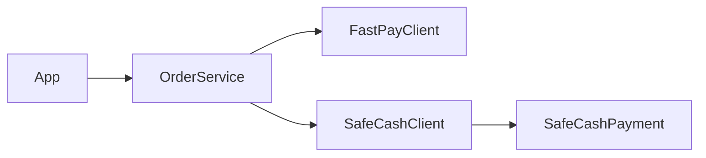
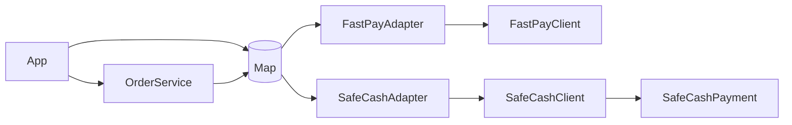

## Answer overview (structure before vs after)

**Problem in the original design**

- `OrderService` was intended to talk directly to SDKs (`FastPayClient`, `SafeCashClient`) with provider-specific glue logic and branching.
- This couples business logic to concrete SDKs and makes adding a new provider require changes inside `OrderService`.

**How the answer fixes it**

- Define a stable target interface `PaymentGateway` with `charge(String customerId, int amountCents)`.
- Implement **adapters** `FastPayAdapter` and `SafeCashAdapter` that wrap the SDKs and translate to/from this interface.
- `OrderService` depends only on `PaymentGateway` and a `Map<String, PaymentGateway>` registry.
- `App` wires the map with adapters; adding a new provider is just adding another entry.

### Before – conceptual structure

### After – Adapter-based structure

