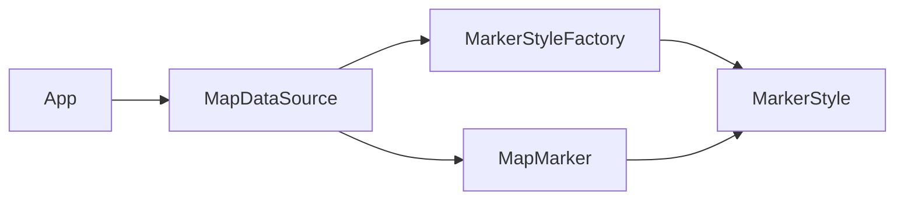

## Answer overview (structure before vs after)

**Problem in the original design**

- Each `MapMarker` creates its own `MarkerStyle` via `new MarkerStyle(...)`.
- Thousands of markers with identical style configurations allocate thousands of duplicate style objects.
- `MarkerStyle` is mutable, so sharing would be unsafe even if attempted.

**How the answer fixes it**

- Make `MarkerStyle` an **immutable flyweight** (all fields `final`, no setters).
- Introduce `MarkerStyleFactory` that caches styles by key (`shape|color|size|filledFlag`).
- Change `MapMarker` to hold shared `MarkerStyle` plus only its extrinsic state (`lat`, `lng`, `label`).
- Update `MapDataSource` so it calls `MarkerStyleFactory.get(...)` and passes the style into the `MapMarker` constructor (no `new MarkerStyle(...)` per marker).

### Before – conceptual structure

### After – Flyweight-based structure

