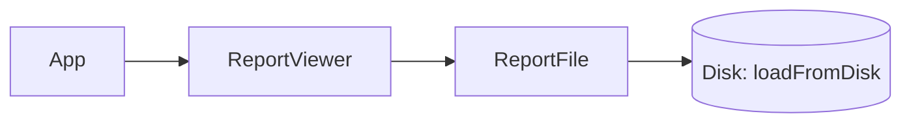
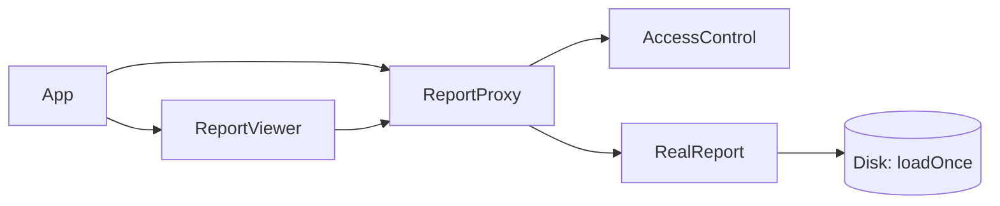

## Answer overview (structure before vs after)

**Problem in the original design**

- `ReportViewer` talks directly to concrete `ReportFile`.
- Every `display()` triggers an expensive disk load, even for repeated views of the same report.
- No access control: any user can open any classification.
- Loading and viewing responsibilities are mixed together.

**How the answer fixes it**

- Introduce a `Report` abstraction (`Report { void display(User user); }`).
- Move the expensive load and printing into `RealReport`, which lazily loads content once and caches it.
- Use `ReportProxy` to:
  - hold only id/title/classification,
  - check access using `AccessControl`,
  - lazily construct and cache a `RealReport` only on allowed access.
- Make `ReportViewer` and `App` work with `Report`/`ReportProxy` instead of `ReportFile`.

### Before – conceptual structure

### After – Proxy-based structure

