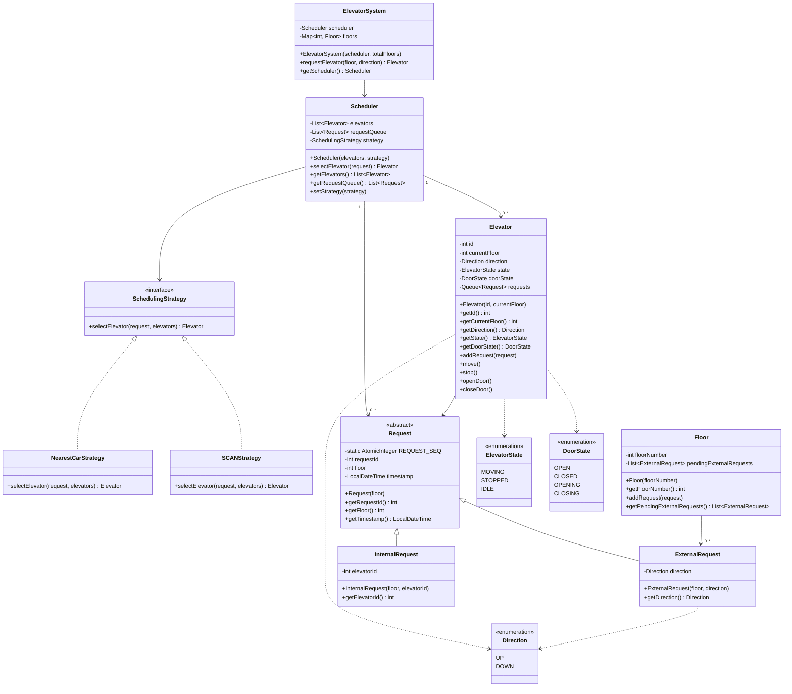

# Assignment5 — Elevator (Class Diagram)

```mermaid
classDiagram

class ElevatorSystem {
  -Scheduler scheduler
  -Map~int, Floor~ floors
  +ElevatorSystem(scheduler, totalFloors)
  +requestElevator(floor, direction) Elevator
  +getScheduler() Scheduler
}

class Scheduler {
  -List~Elevator~ elevators
  -List~Request~ requestQueue
  -SchedulingStrategy strategy
  +Scheduler(elevators, strategy)
  +selectElevator(request) Elevator
  +getElevators() List~Elevator~
  +getRequestQueue() List~Request~
  +setStrategy(strategy)
}

class SchedulingStrategy {
  <<interface>>
  +selectElevator(request, elevators) Elevator
}

class NearestCarStrategy {
  +selectElevator(request, elevators) Elevator
}
class SCANStrategy {
  +selectElevator(request, elevators) Elevator
}

class Elevator {
  -int id
  -int currentFloor
  -Direction direction
  -ElevatorState state
  -DoorState doorState
  -Queue~Request~ requests
  +Elevator(id, currentFloor)
  +getId() int
  +getCurrentFloor() int
  +getDirection() Direction
  +getState() ElevatorState
  +getDoorState() DoorState
  +addRequest(request)
  +move()
  +stop()
  +openDoor()
  +closeDoor()
}

class Request {
  <<abstract>>
  -static AtomicInteger REQUEST_SEQ
  -int requestId
  -int floor
  -LocalDateTime timestamp
  +Request(floor)
  +getRequestId() int
  +getFloor() int
  +getTimestamp() LocalDateTime
}
class ExternalRequest {
  -Direction direction
  +ExternalRequest(floor, direction)
  +getDirection() Direction
}
class InternalRequest {
  -int elevatorId
  +InternalRequest(floor, elevatorId)
  +getElevatorId() int
}

class Floor {
  -int floorNumber
  -List~ExternalRequest~ pendingExternalRequests
  +Floor(floorNumber)
  +getFloorNumber() int
  +addRequest(request)
  +getPendingExternalRequests() List~ExternalRequest~
}

class Direction {
  <<enumeration>>
  UP
  DOWN
}
class ElevatorState {
  <<enumeration>>
  MOVING
  STOPPED
  IDLE
}
class DoorState {
  <<enumeration>>
  OPEN
  CLOSED
  OPENING
  CLOSING
}

ElevatorSystem --> Scheduler
Scheduler --> SchedulingStrategy
SchedulingStrategy <|.. NearestCarStrategy
SchedulingStrategy <|.. SCANStrategy
Scheduler "1" --> "0..*" Elevator
Scheduler "1" --> "0..*" Request
Request <|-- ExternalRequest
Request <|-- InternalRequest
Elevator --> Request
Floor --> "0..*" ExternalRequest
Elevator ..> Direction
Elevator ..> ElevatorState
Elevator ..> DoorState
ExternalRequest ..> Direction
```
