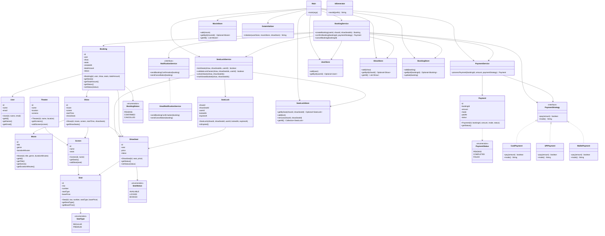

# Assignment5 — Movie Booking System (Class Diagram)

```mermaid
classDiagram

class Main {
  +main(args)
}

class User {
  -id
  -name
  -email
  +User(id, name, email)
  +getId()
  +getName()
  +getEmail()
}
class Movie {
  -id
  -title
  -genre
  -durationMinutes
  +Movie(id, title, genre, durationMinutes)
  +getId()
  +getTitle()
  +getGenre()
  +getDurationMinutes()
}
class Theater {
  -id
  -name
  -location
  -screens
  +Theater(id, name, location)
  +getScreens()
  +addScreen(screen)
}
class Screen {
  -id
  -name
  -seats
  +Screen(id, name)
  +getSeats()
  +addSeat(seat)
}
class Seat {
  -id
  -row
  -number
  -seatType
  -basePrice
  +Seat(id, row, number, seatType, basePrice)
  +getSeatType()
  +getBasePrice()
}
class Show {
  -id
  -movie
  -screen
  -startTime
  -showSeats
  +Show(id, movie, screen, startTime, showSeats)
  +getShowSeats()
}
class ShowSeat {
  -id
  -seat
  -price
  -status
  +ShowSeat(id, seat, price)
  +getStatus()
  +setStatus(status)
}
class Booking {
  -id
  -user
  -show
  -seats
  -createdAt
  -totalAmount
  -status
  +Booking(id, user, show, seats, totalAmount)
  +getSeats()
  +getTotalAmount()
  +getStatus()
  +setStatus(status)
}
class Payment {
  -id
  -bookingId
  -amount
  -mode
  -paidAt
  -status
  +Payment(id, bookingId, amount, mode, status)
  +getStatus()
}
class SeatLock {
  -showId
  -showSeatId
  -userId
  -lockedAt
  -expiresAt
  +SeatLock(showId, showSeatId, userId, lockedAt, expiresAt)
  +isExpired()
}

class SeatStatus {
  <<enumeration>>
  AVAILABLE
  LOCKED
  BOOKED
}
class BookingStatus {
  <<enumeration>>
  PENDING
  CONFIRMED
  CANCELLED
}
class PaymentStatus {
  <<enumeration>>
  PENDING
  COMPLETED
  FAILED
}
class SeatType {
  <<enumeration>>
  REGULAR
  PREMIUM
}

class BookingService {
  +createBooking(userId, showId, showSeatIds) Booking
  +confirmBooking(bookingId, paymentStrategy) Payment
  +cancelBooking(bookingId)
}
class PaymentService {
  +processPayment(bookingId, amount, paymentStrategy) Payment
}
class SeatLockService {
  +lockSeats(show, showSeatIds, userId) boolean
  +validateLockOwner(show, showSeatIds, userId) boolean
  +unlockSeats(show, showSeatIds)
  +markSeatsBooked(show, showSeatIds)
}
class NotificationService {
  <<interface>>
  +sendBookingConfirmation(booking)
  +sendCancellation(booking)
}
class EmailNotificationService {
  +sendBookingConfirmation(booking)
  +sendCancellation(booking)
}

class PaymentStrategy {
  <<interface>>
  +pay(amount) boolean
  +mode() String
}
class CardPayment {
  +pay(amount) boolean
  +mode() String
}
class UPIPayment {
  +pay(amount) boolean
  +mode() String
}
class WalletPayment {
  +pay(amount) boolean
  +mode() String
}

class UserStore {
  +add(user)
  +getById(userId) Optional~User~
}
class MovieStore {
  +add(movie)
  +getById(movieId) Optional~Movie~
  +getAll() List~Movie~
}
class ShowStore {
  +add(show)
  +getById(showId) Optional~Show~
  +getAll() List~Show~
}
class BookingStore {
  +add(booking)
  +getById(bookingId) Optional~Booking~
  +update(booking)
}
class SeatLockStore {
  +getBySeat(showId, showSeatId) Optional~SeatLock~
  +add(lock)
  +remove(showId, showSeatId)
  +getAll() Collection~SeatLock~
}

class DataInitializer {
  +initialize(userStore, movieStore, showStore) String
}
class IdGenerator {
  +nextId(prefix) String
}

Main --> DataInitializer
Main --> BookingService
Main --> PaymentService
Main --> SeatLockService
Main --> UserStore
Main --> MovieStore
Main --> ShowStore
Main --> BookingStore
Main --> SeatLockStore

Theater --> Screen
Screen --> Seat

BookingService --> UserStore
BookingService --> ShowStore
BookingService --> BookingStore
BookingService --> SeatLockService
BookingService --> PaymentService
BookingService --> NotificationService
BookingService --> Booking
BookingService --> PaymentStrategy

SeatLockService --> SeatLock
SeatLockService --> ShowSeat

PaymentService --> PaymentStrategy
PaymentService --> Payment
SeatLockService --> SeatLockStore

NotificationService <|.. EmailNotificationService
PaymentStrategy <|.. CardPayment
PaymentStrategy <|.. UPIPayment
PaymentStrategy <|.. WalletPayment

Show --> Movie
Show --> Screen
Show --> ShowSeat
ShowSeat --> Seat
Booking --> User
Booking --> Show
Booking --> ShowSeat
Payment ..> PaymentStatus
SeatLock --> ShowSeat
Seat --> SeatType
ShowSeat --> SeatStatus
Booking --> BookingStatus
```
